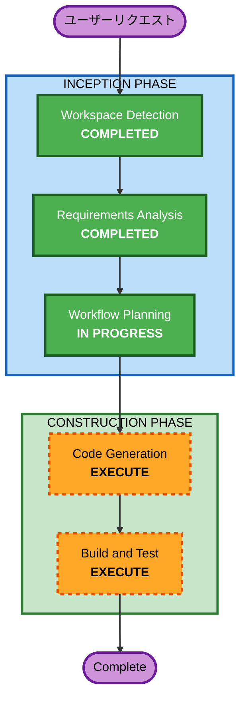

# Execution Plan - UX改善（iOS風UI・自動保存）

## 詳細分析サマリー

### 変更影響評価
- **ユーザー影響**: あり — 編集フロー全体が変更（インライン編集 → iOS設定アプリ風遷移）
- **構造変更**: あり — ルーティング構造に編集サブページを追加
- **データモデル変更**: なし — Nursery型はそのまま維持
- **API変更**: なし — クライアントサイドのみ
- **NFR影響**: 軽微 — アニメーションパフォーマンス要件の追加のみ

### コンポーネント関係
- **変更対象**: NurseryDetail.tsx, NurseryForm.tsx, app/nursery/[id]/page.tsx
- **新規追加**: トーストコンポーネント, 編集サブページ群（園名・見学日・メモ）, カレンダーピッカー
- **変更なし**: stores/nurseryStore.ts, types/nursery.ts, services/storageService.ts

### リスク評価
- **リスクレベル**: 低
- **ロールバック**: 容易（UIの変更のみ、データモデル変更なし）
- **テスト複雑度**: 中程度（画面遷移・保存タイミングのテストが必要）

## ワークフロー可視化



### テキスト代替
```
INCEPTION PHASE:
  - Workspace Detection (COMPLETED)
  - Requirements Analysis (COMPLETED)
  - Workflow Planning (IN PROGRESS)

CONSTRUCTION PHASE:
  - Code Generation (EXECUTE)
  - Build and Test (EXECUTE)
```

## 実行するステージ

### INCEPTION PHASE
- [x] Workspace Detection (COMPLETED)
- [ ] Reverse Engineering — SKIP: 前回実施済み、既存アーティファクトあり
- [x] Requirements Analysis (COMPLETED)
- [ ] User Stories — SKIP: 既存ストーリー（US-01〜13）でカバー。今回はUI/UXパターンの変更のみでストーリーの追加・変更は不要
- [x] Workflow Planning (IN PROGRESS)
- [ ] Application Design — SKIP: 新しいサービスやビジネスロジックの追加なし。既存のコンポーネント構成内でのUI変更
- [ ] Units Generation — SKIP: 単一ユニット

### CONSTRUCTION PHASE
- [ ] Functional Design — SKIP: 複雑なビジネスロジックの追加なし（UIパターン変更のみ）
- [ ] NFR Requirements — SKIP: 既存NFR設定で十分、アニメーション要件はコード生成時に対応
- [ ] NFR Design — SKIP
- [ ] Infrastructure Design — SKIP: インフラ変更なし
- [ ] Code Generation — **EXECUTE**: UIコンポーネントの実装が必要
- [ ] Build and Test — **EXECUTE**: ビルド・テスト・検証が必要

## 成功基準
- **主目標**: Primary Persona マイがiPhoneの操作感覚で迷わず使えるUIに刷新
- **主な成果物**:
  - iOS設定アプリ風の編集フロー（chevron right → 遷移 → 戻ると保存）
  - 控えめな保存トースト通知
  - iOS風ナビゲーション（スワイプアニメーション、戻るボタン）
  - 園追加時の見学日簡易選択（今日 / あとで設定する）
  - 園詳細のカレンダーピッカー
- **品質ゲート**: ビルド成功、既存テスト + 新規テスト全パス
