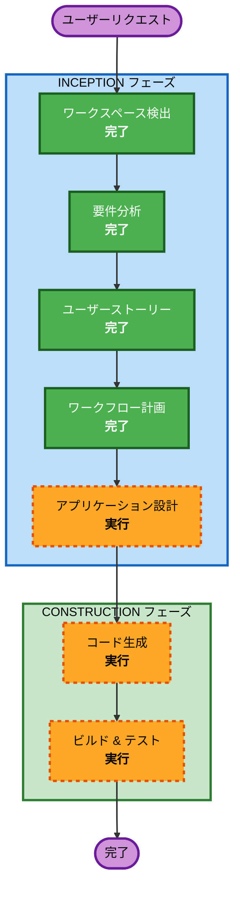

# 実行プラン - 保活手帳 v1 SLC

## 詳細分析サマリー

### 変更影響評価
- **ユーザー向け変更**: あり - 全機能がエンドユーザー向け（4画面、13ユーザーストーリー）
- **構造的変更**: あり - ゼロからのアプリ構築（Next.js + Tailwind CSS）
- **データモデル変更**: あり - localStorage上のAppState/Nurseryモデル（PRDで定義済み）
- **API変更**: なし - クライアントサイドのみ、外部APIなし
- **非機能要件への影響**: あり - PWA、セキュリティヘッダー、アナリティクス、パフォーマンス要件

### リスク評価
- **リスクレベル**: 低
- **ロールバックの複雑さ**: 容易（新規構築、既存システムへの影響なし）
- **テストの複雑さ**: シンプル（localStorageベースのCRUD、外部依存なし）

---

## ワークフロー図



### テキスト版
```
フェーズ1: INCEPTION
- ワークスペース検出（完了）
- 要件分析（完了）
- ユーザーストーリー（完了）
- ワークフロー計画（完了）
- アプリケーション設計（実行）

フェーズ2: CONSTRUCTION
- コード生成（実行）
- ビルド & テスト（実行）
```

---

## 実行するステージ

### INCEPTION フェーズ
- [x] ワークスペース検出（完了）
- [x] リバースエンジニアリング（スキップ - 新規構築）
- [x] 要件分析（完了）
- [x] ユーザーストーリー（完了）
- [x] ワークフロー計画（完了）
- [ ] アプリケーション設計 - **実行**
  - **理由**: 新規構築のため、コンポーネント構成とサービス層の設計が必要。画面構成（4画面）、コンポーネント階層、データフローを定義する。
- ユニット生成 - **スキップ**
  - **理由**: アプリの規模が小さく（4画面、CRUD操作）、単一ユニットとして構築可能。分割の必要なし。

### CONSTRUCTION フェーズ
- 機能設計 - **スキップ**
  - **理由**: ビジネスロジックがシンプルなCRUD操作。データモデルはPRDで定義済み。アプリケーション設計で十分カバーできる。
- NFR要件 - **スキップ**
  - **理由**: NFR要件はrequirements.mdで既に定義済み（PWA、セキュリティ、パフォーマンス）。別途ステージを設ける複雑さはない。
- NFR設計 - **スキップ**
  - **理由**: NFRパターン（PWA設定、セキュリティヘッダー、アナリティクス）はコード生成時にrequirements.mdを参照して組み込む。
- インフラ設計 - **スキップ**
  - **理由**: Vercelへのデプロイはフレームワーク標準。複雑なインフラ設計不要。
- [ ] コード生成 - **実行**（常時実行）
  - **理由**: アプリケーション全体のコード実装。単一ユニットとして実行。
- [ ] ビルド & テスト - **実行**（常時実行）
  - **理由**: ビルド確認、テスト実行、品質ゲート。

### OPERATIONS フェーズ
- 運用 - **プレースホルダー**

---

## 成功基準
- **主目標**: 「見学の記憶を、申込時まで鮮度高く残す」アプリのv1 SLC完成
- **主要成果物**:
  - Next.js + Tailwind CSS のフルアプリケーション
  - 4画面（オンボーディング、園一覧、園追加、園詳細）
  - PWA対応（オフライン動作）
  - GA4 + Clarity アナリティクス
  - Vitest + Testing Library によるテスト
  - Vercelデプロイ可能な状態
- **品質ゲート**:
  - 全ユーザーストーリー（US-01〜US-13）の受け入れ基準を満たす
  - セキュリティ拡張ルール（SECURITY-01〜15）への準拠
  - テストカバレッジ確保
